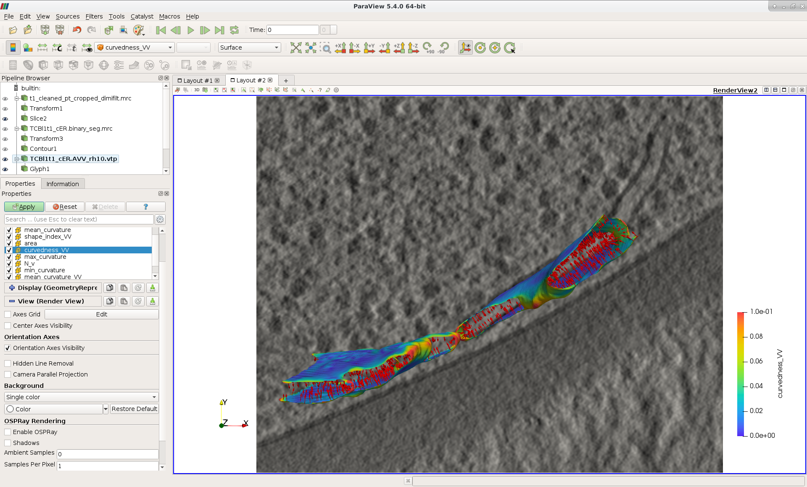

PyCurv
======

This Python-based software was developed mainly to analyse curvature of
membranes in 3D originating from high-resolution, noisy cryo-electron tomograms.
Additionally, the software was also applied to other volumetric data with
segmented structures or directly surface data, e.g. brain or organs from MRI and
cells from confocal light microscopy.
Accepted image data formats are: MRC, EM, VTI, NII.
Accepted surface data formats are: VTP, VTK, STL, PLY.

Moreover, the software can be used to calculate distances between two adjacent
membranes and thicknesses of a membrane organelle.

Furthermore, the software enables to calculate density distribution of
particles mapped on a membrane, e.g. membrane-bound ribosomes.

The software output is mostly in VTP format (triangle-mesh surfaces with
numerical properties like curvatures, distances or densities), which can be
visualized and further analysed in 3D using an external tool,
`ParaView <https://www.paraview.org/>`_.
Also CSV table files for plotting the results are produced and many plotting
functions are included.

``pycurv`` package
----------------------

This is the main Python package containing modules, classes and functions used
for the following analyses:

* 
  Estimation of membrane curvature using our several tensor voting-based methods
  based on (Page et al. 2002, Graphical Models) and (Tong and Tang 2005, IEEE
  Transactions on Pattern Analysis and Machine Intelligence), details available
  in (\ `Salfer et al. 2020, PLoS Computational biology <https://doi.org/10.1371/journal.pcbi.1007962>`_\ ).
  The workflow consists of the following three main steps:

  #. signed surface generation from a segmentation
  #. surface graph generation and surface cleaning
  #. estimation of normal vectors of the true surface per triangle
  #. principle directions and curvatures estimation per triangle.

  The main parameter of our methods, ``radius_hit`` (borrowed from Tong and Tang
  2005 ) should be set to the radius of the smallest feature of interest on the
  input surface (in the target units, e.g. nanometers). It is used to define a
  geodesic neighborhood of triangles for each central triangle.

  Our method of choice is AVV (augmented vector voting), because it proved to be
  the most robust to noisy and irregularly triangulated surface and to variable
  feature size.

* 
  Calculation of distances between two adjacent membranes and thicknesses of a
  membrane organelle, using the membrane surfaces and outgoing normal vectors
  (estimated as in step iii. in the curvature estimation workflow) from the
  first, flat membrane surface.

* 
  Calculation of ribosome density on ER and vesicle membranes using a mask with
  ribosome coordinates on the membranes and the membrane mask.

``pycurv_scripts`` package
------------------------------

This package contains Python scripts applying the PyCurv package and
combining different functions into the workflows described above, the main are:

* ``curvature_calculation.py`` script for membrane curvature calculation workflows
  used in (\ `Bäuerlein et al. 2017, Cell <https://doi.org/10.1016/j.cell.2017.08.009>`_\ )
  and (\ `Collado et al. 2019, Developmental Cell <https://doi.org/10.1016/j.devcel.2019.10.018>`_\ )
* ``distances_calculation.py`` script for membrane distances and thicknesses
  calculation used in (Collado et al. 2019)
* ``ribosome_density_calculation.py`` script for ribosome density calculation used
  in (Bäuerlein et al. 2017).

``scripts_running_mindboggle_and_freesurfer`` folder
--------------------------------------------------------

Python and bash scripts running Mindboggle (Klein et al. 2017, PLoS Computational
Biology) and FreeSurfer (Pienaar et al. 2008, International Journal of Imaging
Systems and Technology) curvature estimation functions and extracting the values
to CSV files.

``pycurv_testing`` package
------------------------------

This package was used for testing our and external curvature estimation
algorithms from VTK (Schroeder et al., 2006, Kitware), FreeSurfer and
Mindboggle. It contains:

* code used to generate synthetic surfaces
* error calculation module
* scripts getting FreeSurfer's and Mindboggle's curvatures and calculating
  errors from their output VTK files.
* integration and unit tests for the main PyCurv workflows and functions
* a collection of plotting functions.
* folders with output of curvature tests, e.g. ``test_vector_voting_output``\ ),
  and the test surfaces, e.g. ``torus/noise0/torus_rr25_csr10.surface.vtp``.

``experimental_data_sets`` folder
-------------------------------------

Some experimental data can be found here:

* vesicle: membrane segmentation of a vesicle from a cryo-electron tomogram
  (Bäuerlein et al. 2017)
* ER: compartment segmentation of a cortical ER membrane from a
  cryo-electron tomogram (Collado et al. 2019), deposited in EM Data Bank
  (EMD-10765)
* Golgi and vesicles: compartment segmentations of the Golgi apparatus and
  Golgi-derived vesicles from a cryo-electron tomogram, deposited in EM Data
  Bank (EMD-10766)
* embryo: surfaces of C. elegans embryo cells imaged by confocal light
  microscopy and segmented by LimeSeg (Machado et al., BMC Bioinformatics 2019)
* brain: cortical pial surfaces of both human brain hemispheres imaged by MRI
  and segmented by FreeSurfer, taken from
  `Mindboggle example data <https://osf.io/8cf5z/>`_.

Output of the following curvature algorithms is included for experimental data
(AVV and SSVV output also includes minimum and maximum principal curvatures
calculated by VTK):

* vesicle: AVV
* ER: AVV, SSVV and Mindboggle
* Golgi and vesicles: AVV
* embryo: AVV
* brain: AVV, Mindboggle, FreeSurfer

Installing PyCurv
=================

Please note that PyCurv depends on a publicly available Python package,
Pyto (Lučić et al., 2016, PMID: 27742578, DOI: 10.1016/j.jsb.2016.10.004), it
can be found `here <https://github.com/vladanl/Pyto>`_.

Installation instructions with anaconda
---------------------------------------

The following instruction were tested on SUSE Linux Enterprise Server 12, but
they should work on other Linux-based systems.

#. 
   Install anaconda with `graph-tool <https://graph-tool.skewed.de/>`_
   (Peixoto, 2014) and its dependencies:

   .. code-block::

      targetFold=<your_anaconda_path>
      wget https://repo.anaconda.com/archive/Anaconda3-2019.10-Linux-x86_64.sh
      bash Anaconda3-2019.10-Linux-x86_64.sh -b -p $targetFold

      export PATH=$targetFold/bin:$PATH

      conda config --set allow_conda_downgrades true

      conda install conda=4.6.14

      conda config --set allow_conda_downgrades true
      conda config --add channels pkgw-forge
      conda config --add channels conda-forge
      conda config --add channels ostrokach-forge

      conda install -c pkgw-forge gtk3
      conda install -c conda-forge pygobject
      conda install -c conda-forge matplotlib
      conda install -c ostrokach-forge graph-tool

      export PATH=$targetFold/bin:$PATH

   From the same bash shell, ``which python`` should output
   ``<your_anaconda_path>/bin/python``.

   You should be able to import ``graph_tool`` from a ``python`` or ``ipython`` shell:

   .. code-block:: python

      from graph_tool.all import *

   In order that your anaconda python is found every time you open a new
   bash shell, add it to PATH by adding the following line to your ``~/.bashrc``\ :

   .. code-block::

      export PATH=<your_anaconda_path>/bin:$PATH

#. 
   Add the path to the `Pyto <https://github.com/vladanl/Pyto>`_ package to PYTHONPATH in your ``~/.bashrc``
   (See https://stackoverflow.com/questions/19917492/how-to-use-pythonpath and
   https://docs.python.org/3.6/tutorial/modules.html):

   .. code-block::

      export PYTHONPATH=<your_path_to_pyto>:$PYTHONPATH

#. 
   To download the PyCurv package, run from a bash shell:

   .. code-block::

      cd <path_to_installation>  # your destination folder
      git clone https://github.com/kalemaria/pycurv.git

   The folder ``pycurv`` should be created, containing the modules and folders
   listed here.

#. 
   Install dependencies from the ``setup.py``\ :

   .. code-block::

      cd <path_to_installation>/pycurv
      python setup.py install

   You should be able to import ``pycurv``\ , ``pycurv_testing`` and ``pycurv_scripts``
   from a ``python`` or ``ipython`` shell.

Installation instructions without anaconda
------------------------------------------

The following instruction were tested on Ubuntu 18.04, but the process should be
equivalent for other Ubuntu versions. Ubuntu can be installed for free, also in
a virtual machine on other operating systems (Windows or Mac).
Ubuntu 18.04 has ``python3`` version 3.6.7 preinstalled.

#. 
   Install `graph-tool <https://graph-tool.skewed.de/>`_ (Peixoto, 2014)
   for Ubuntu according to `instructions <https://git.skewed.de/count0/
   graph-tool/wikis/installation-instructions#debian-ubuntu>`_\ ,
   ``DISTRIBUTION=bionic``\ , but before running ``apt-get update`` add the public key:

   .. code-block::

      apt-key adv --keyserver pgp.skewed.de --recv-key 612DEFB798507F25

   Unfortunately, this installation of the graph-tool package does not work with
   anaconda python.

#. 
   Add the path to the `Pyto <https://github.com/vladanl/Pyto>`_ package to PYTHONPATH in bashrc.

#. 
   Install `pip3 <https://linuxize.com/post/how-to-install-pip-on-ubuntu-18.04/>`_
   (includes setuptools), `venv <https://docs.python.org/3/library/venv.html>`_
   (from Python version 3.3 on, recommended from version 3.5 on) in e.g.
   ``~/workspace``\ :

   .. code-block::

      python3 -m venv ./venv –system-site-packages

   and activate:

   .. code-block::

      source venv/bin/activate

   ``ipython3`` should be present and you should be able to import ``graph_tool``\ :

   .. code-block:: python

      from graph_tool.all import *

#. 
   To download the PyCurv package, run from a bash shell:

   .. code-block::

      cd <path_to_installation>  # your destination folder
      git clone https://github.com/kalemaria/pycurv.git

   The folder ``pycurv`` should be created, containing the modules and folders
   listed here.

#. 
   Install dependencies from the ``setup.py``\ :

   .. code-block::

      cd <path_to_installation>/pycurv
      python setup.py install

   You should be able to import ``pycurv``\ , ``pycurv_testing`` and ``pycurv_scripts``
   from a ``python`` or ``ipython`` shell.

#. 
   To re-create the environment on another computer or after
   re-installation, freeze the current state of the environment packages:

   .. code-block::

      pip freeze > requirements_pycurv.txt

   To re-create the environment:

   .. code-block::

      pip install -r requirements_pycurv.txt

Applying PyCurv
===============

To test your PyCurv installation, you can run tests on synthetic surfaces or
workflow scripts on the provided experimental data sets, as explained in the
next subsections.
Then, you can build your own PyCurv curvature estimation workflow, as explained
step-by-step in the "User manual" subsection.
For the full documentation of all modules and functions, please consult
``<path_to_installation>/pycurv/docs/_build/html/py-modindex.html)``.

Running the tests
-----------------

To run the integration tests of the curvature workflow on synthetic surfaces,
execute from a bash shell:

.. code-block::

   pytest -q --disable-pytest-warnings <path_to_installation>/pycurv/pycurv_testing/
   test_vector_voting.py

To run a specific test, for example ``test_sphere_curvatures``\ , run:

.. code-block::

   pytest -q --disable-pytest-warnings <path_to_installation>/pycurv/pycurv_testing/
   test_vector_voting.py::test_sphere_curvatures

If it does not work, try to replace ``pytest -q`` by ``python -m pytest``.

A folder ``test_vector_voting_output`` containing the test results will be created
inside the current directory.

In the same manner, you can run:

* the integration tests of the distances and thicknesses workflow
  (\ ``test_distances_calculation.py``\ )
* the unit test of histogram area calculation
  (\ ``test_histogram_area_calculation.py``\ )
* the unit test for some linear algebra functions (\ ``test_linalg.py``\ )

Running the experimental data sets
----------------------------------

To run the curvature estimation workflow on the vesicle and ER segmentation in
the ``experimental_data_sets`` folder, just run in a bash shell:

.. code-block::

   cd <path_to_installation>/pycurv/pycurv_scripts
   python curvature_calculation.py

The output will be generated in the respective subfolders of the input,
``vesicle`` and ``ER``.
You can change the parameters and find more workflow examples in the script.

User manual
-----------

If the tests and the examples above worked for you, now you can learn how to
build your own PyCurv curvature estimation workflow.  

.. image:: images/Workflow.png
   :target: images/Workflow.png
   :alt: Workflow

Imports
^^^^^^^

Fist, import the following:

.. code-block:: python

   from pycurv import pycurv_io as io
   from pycurv import run_gen_surface, THRESH_SIGMA1, TriangleGraph, MAX_DIST_SURF
   import numpy as np
   from scipy import ndimage
   from graph_tool import load_graph

Parameters
^^^^^^^^^^

Initialize the following parameters for your run:

.. code-block:: python

   fold = <your_path_to_input>  # output will be also written there
   base_filename = <prefix_for_your_output_files>
   pixel_size = <nanometers>  # pixel size of the (underlying) segmentation
   radius_hit = <nm>  # radius of the smallest feature of interest (neighborhood)

   # alternative or optional:
   # for step 1.:
   #   for segmentation input:
   seg_file = <your_segmentation_file>  # MRC in this example
   label = <membrane_label>
   cube_size = <pixels>  # try 3 or 5
   filled_label = <lumen_label>  # if compartment segmentation
   #   for surface input:
   surf_file = <your_surface_file>  # VTP in this example
   # for step 2.:
   # to remove small disconnected surface components within this size (default 100)
   min_component = <number_triangles>
   # for step 3.:
   methods = ["VV", "SSVV"]  # list of algorithms to run (default "VV")
   area2 = <True_or_False>  # if method "VV": True for AVV (default), False for RVV
   cores = <cores>  # number of cores to run VV in parallel (default 6)

Building your workflow
^^^^^^^^^^^^^^^^^^^^^^

#. 
   Generate or load the surface.

   #. 
      If the input is a segmentation (here MRC), load it first:

      .. code-block:: python

         seg = io.load_tomo(fold + seg_file)
         data_type = seg.dtype

      #. 
         If the segmentation is not filled (contains only membrane label),
         generate the surface using the *membrane segmentation* algorithm.
         First, get the membrane segmentation:

         .. code-block:: python

            binary_seg = (seg == label).astype(data_type)

         Then, generate surface delineating the membrane segmentation:

         .. code-block:: python

            surf = run_gen_surface(binary_seg, fold + base_filename, lbl=1)

         However, the surface is not always oriented properly, especially if
         there are holes in the segmentation. To close small holes (fitting in
         the given cube) in the segmentation, run before ``run_gen_surface``\ :

         .. code-block:: python

            cube = np.ones((cube_size, cube_size, cube_size))
            binary_seg = ndimage.binary_closing(
                binary_seg, structure=cube, iterations=1).astype(data_type)

      #. 
         If the segmentation is filled, generate the surface using the
         *compartment segmentation* algorithm. This is the preferred approach,
         because the surface is always properly oriented. As in the previous
         case, first, get the membrane segmentation:

         .. code-block:: python

            binary_seg = (seg == label).astype(data_type)

         Second, combine the membrane segmentation with the lumen segmentation
         into compartment (filled) segmentation:

         .. code-block:: python

            filled_binary_seg = np.logical_or(
                seg == label, seg == filled_label).astype(data_type)

         Then, generate isosurface around the slightly smoothed compartment
         segmentation and apply the mask of membrane segmentation:

         .. code-block:: python

            surf = run_gen_surface(
                filled_binary_seg, fold + base_filename, lbl=1,
                other_mask=binary_seg, isosurface=True, sg=1, thr=THRESH_SIGMA1)

      In both above cases, the surface is saved to a VTP file named
      ``fold + base_filename + ".surface.vtp"``.

   #. 
      If the input is a surface (here VTP), omit the above steps and load it:

      .. code-block:: python

         surf = io.load_poly(fold + surf_file)

#. 
   From the surface, generate a "triangle" graph, with vertices at triangle
   centers and edges between neighboring triangles:

   .. code-block:: python

      tg = TriangleGraph()
      scale = (pixel_size, pixel_size, pixel_size)
      tg.build_graph_from_vtk_surface(surf, scale)

   If the surface has borders, they have grown a bit during the surface
   generation (in order to bridge upon small holes) and should be removed:

   .. code-block:: python

      tg.find_vertices_near_border(MAX_DIST_SURF * pixel_size, purge=True)

   You may filter out possibly occurring small disconnected fragments:

   .. code-block:: python

      tg.find_small_connected_components(
          threshold=min_component, purge=True, verbose=True)

   You can check the number of graph vertices and edges before / after each
   step:

   .. code-block:: python

      print('The graph has {} vertices and {} edges'.format(
          tg.graph.num_vertices(), tg.graph.num_edges()))

   It might be a good idea to save the graph and the clean surface into files:

   .. code-block:: python

      clean_graph_file = '{}.scaled_cleaned.gt'.format(base_filename)
      clean_surf_file = '{}.scaled_cleaned.vtp'.format(base_filename)
      tg.graph.save(fold + clean_graph_file)
      surf_clean = tg.graph_to_triangle_poly()
      io.save_vtp(surf_clean, fold + clean_surf_file)

   This way, you can load the graph and the surface to continue later:

   .. code-block:: python

      surf_clean = io.load_poly(fold + clean_surf_file)
      tg = TriangleGraph()
      tg.graph = load_graph(fold + clean_graph_file)

#. 
   Then, you can estimate surface normals at each triangle center using a
   geodesic neighborhood of triangles, and finally, estimate principle
   directions and curvatures as well as calculate different combined indices
   using one of the tensor voting-based algorithms: RVV, AVV (default) or SSVV:

   .. code-block:: python

      method_tg_surf_dict = normals_directions_and_curvature_estimation(
          tg, radius_hit, methods=methods, area2=area2, cores=cores,
          poly_surf=surf_clean)  # required only for SSVV

   Save the output (graph and surface objects) for later filtering or inspection
   in ParaView:

   .. code-block:: python

      for method in list(method_tg_surf_dict.keys()):
          (tg, surf) = method_tg_surf_dict[method]
          if method == 'VV':
              if area2 is False:
                  method = 'RVV'
              else:
                  method = 'AVV'
          gt_file = '{}{}.{}_rh{}.gt'.format(
              fold, base_filename, method, radius_hit)
          tg.graph.save(gt_file)
          surf_file = '{}{}.{}_rh{}.vtp'.format(
              fold, base_filename, method, radius_hit)
          io.save_vtp(surf, surf_file)

Analyzing the output
^^^^^^^^^^^^^^^^^^^^

The output VTP file is a surface with all the calculated values stored as
triangle properties, which can be visualized in
`ParaView <https://www.paraview.org/>`_.

* normal: original triangle normal
* area: triangle are in the input units (e.g. nm)

The following properties are estimated using each of our algorithms:

* ``N_v``\ : estimates triangle normal
* ``T_1``\ : maximal principal direction
* ``T_2``\ : minimal principal direction
* ``kappa1``\ : maximal principle curvature
* ``kappa2``\ : minimal principle curvature
* ``mean_curvature_VV``\ : mean curvature
* ``gauss_curvature_VV``\ : Gauss curvature
* ``curvedness_VV``\ : curvedness
* ``shape_index_VV``\ : Shape Index

The following properties are calculated using VTK per triangle vertex using
only 1-ring neighbors, 3 triangle values are averaged per triangle:

* ``max_curvature``\ : maximal principle curvature
* ``mean_curvature``\ : minimal principle curvature
* ``mean_curvature``\ : mean curvature
* ``gauss_curvature``\ : Gauss curvature

To extract the curvatures into a CSV file, run:

.. code-block:: python

   extract_curvatures_after_new_workflow(
       fold, base_filename, radius_hit, methods=['VV'], exclude_borders=1

Because of the last option, two files will be output: with all values and
excluding those within 1 nm to the surface border.

Finally, you can plot your results in the CSV file, using for example
``<path_to_installation>/pycurv/pycurv_testing/plotting.py``.

Reporting bugs
==============

If you have found a bug or have an issue with the software, please open an issue
`here <https://github.com/kalemaria/pycurv/issues>`_.

Citing PyCurv
=============

If you have used PyCurv for a scientific work, please cite the publication
"Reliable estimation of membrane curvature for cryo-electron tomography"
(\ `Salfer et al. 2020, PLoS Computational biology <https://doi.org/10.1371/journal.pcbi.1007962>`_\ ).
